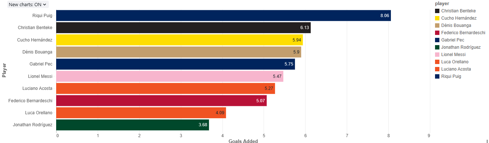

# MLS Data Pipeline Project Overview
This project automates the ingestion, cleansing, processing, and storage of given datasets into Delta Tables for scalable analytics. This pipeline was designed to handle various data sources and prepare the data for queries, reports, and visualizations.

---

## Project Goals
- Automate the ingestion and cleansing of raw datasets, ensuring consistency and quality through all processed data.
- Create a pipeline that processes data into clean formats for analytics and visualization.
- Store processed data in Delta Tables for efficient querying and reporting.
- Create a visualization for analysis to demonstrate how the data can be used.

---

## Pipeline Workflow
1. **Raw Data Ingestion**:
   - Datasets are ingested from CSV files.
2. **Data Cleansing**:
   - Handles duplicates, missing values, and invalid characters.
   - Standardizes dates and monetary values.
   - Generates a consistent 'player_id' for all datasets.
3. **Schema Creation**:
   - Defines database tables with strict schemas for consistency.
4. **Delta Table Creation**:
   - Processes clean data into Delta Tables for scalable querying.
5. **Visualization**
   - Visual created to show top players by goals added.

---

## Assumptions
  - Missing values are left as null for better accuracy in future analysis.
  - 'player_id' is globally unique and consistent across datasets.
  - Datasets inputted follow a specific date structure (MM/DD/YYYY or MM-DD-YYYY)
  - Delta Tables are used for querying and analytics to ensure scalability and reliability.

---
  
## Prerequisites
- **Databricks Workspace**: To run the pipeline and manage Delta Tables.
- **Python 3.8+**: For data cleansing and schema scripts.
- **Git**: For version control

---

## How to Run Pipeline
  1. Clone the repository:
     '''bash
     git clone https://github.com/xaviern03/atlutdproject.git
2. Set up your environment:
   - Ensure Python 3.8+ and necessary libraries are installed (pandas, sqlite3, os, json, PySpark)
   - Install Spark if running locally
3. Run the Python scripts:
   - Data Cleansing:
     '''bash
     python aud_cleanse.py
   - Schema Creation:
     '''bash
     python aud_schema.py
4. Upload processed data to Databricks
  - Logged into Databricks workspace.
  - Created cluster and configured it with:
      - **Cluster Mode**: Single Node
      - **Databricks Runtime Version**: Most updated 15.x LTS
  - Place files in /dbfs/FileStore/tables/
5. Run the Databricks notebook:
  - Execute the pipeline to create Delta Tables
  - Verify with:
    '''sql
    SELECT * FROM match_data LIMIT 10;

---

## How to Access Processed Data
### Clone Repository
To start, clone the repository to your local machine or directly into Databricks Workspace:
git clone https://github.com/xaviern03/atlutdproject.git

## Run the Databricks Notebook
1. Upload the Databricks notebook from the repository into your workspace (aud_pipeline_automation.ipynb)
2. Attach the notebook to your cluster
3. Execute the notebook to create Delta Tables and query the data

### Delta Tables
- **Location**: Available in Databricks and registered as tables:
  - match_data
  - salary_data
  - player_pass_data
  - player_goals_data

- **Query Example**:
  '''sql
  SELECT * FROM player_pass_data LIMIT 10;

  ### Processed CSV Files
- **Location**:
  - Databricks DBFS: /dbfs/FileStore/tables/processed_*.csv
- **Access Example**
  '''python
  import pandas as pd
  df = pd.read_csv("/dbfs/FileStore/tables/processed_match_data.csv")
  print(df.head())

## Visualization
- The visualization for "Top Players by Goals Added" can be found in the notebook: `aud_pipeline_automation.html`, It highlights the top 10 players sorted by their `goals_added` metric, using a bar chart for easy interpretation.
    

## Challenges
1. **First Time Using Databricks**
   - This was my first experience using Databricks and I had to familiarize myself with its features, including Delta Tables, Clusters, and Workflow Automation.
   - I quickly learned how to set up and run pipelines, troubleshoot schema mismatches, and integrate Databricks with GitHub. The project gave me good practical experience and confidence in using Databricks for scalable projects in the future.
3. **Handling Schema Mismatches**
   - Schema mismatches occured when new columns were added like 'player_id'. To solve this I enabled schema evolution in Delta Tables using .option("mergeSchema", "true")
4. **Generating Consistent player_id's**
   - Players appeared in multiple datasets with different IDs. To fix this I used global mapping to ensure the player_id's stayed consistent.
     

  
    

